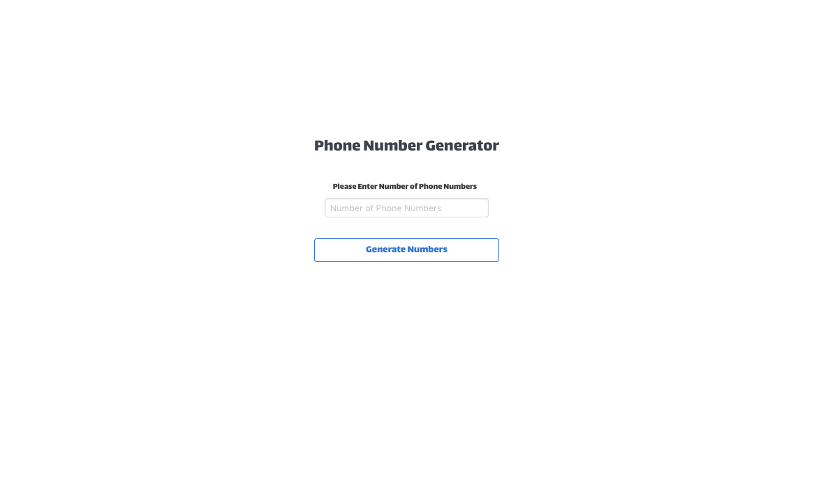

[](https://opensource.org/licenses/MIT)
[](https://travis-ci.com/benfluleck/random-phone-number-generator)
[](https://coveralls.io/github/benfluleck/random-phone-number-generator?branch=chore-implement-tests-for-apis)


# Random Phone Generator

The random phone number generator is a project inspired by my LMS Outputs for Andela. The goal is to enter the amount of phone numbers, you would like to generate. The results are generated in a text file which consists of these phone numbers sorted in descending order.

<br />
<br />




# Table of Contents

- [Getting Started](#getting-started)
- [Technology Stack](#technology-stack)
- [Installation](#installation)
- [Usage](#usage)
- [Testing](#testing)
- [API Endpoints](#api-endpoints)
- [Questions](#questions)
- [Support or Contribution](#support-or-contribution)


## Getting Started
This is a javascript application built with [**Node JS**](https://nodejs.org/en/) using [**Express**](https://expressjs.com/) framework. This application runs on any browser that is not IE as there are issues with the file-downloader.

## Technology Stack
**UI & Templates**
1. Bulma CSS Framework
2. Styled-components

**Server Side**
1. NodeJS
2. Express FrameWork

**Client Side**
1. React JS
2. WebPack


## Installation

1. Install [**Node JS**](https://nodejs.org/en/).

2. Clone the [**repository here**](https://github.com/benfluleck/random-phone-number-generator)
3. [**cd**] into the root of the **project directory**.
4. Run `yarn install` on the terminal to install project dependecies
5. Create a `.env` file in the root directory of the application. Example of the content of a .env file is shown in the .env.sample

6. Start the application:
**_Different Build Environments_**

**Production**
```
yarn build:client-prod
yarn build:server-prod
yarn start:server-prod
```
**Development**
```
yarn client:dev
yarn server:dev
```

## Usage
- Start the application by running the server `yarn server:dev`
- You can test routes on Postman
- To start the client `yarn client:dev`
- Install **Postman** and use to test all endpoints

## Testing

Sever side tests - Run `yarn test` on the terminal while within the **project root directory**.
Client side tests - Run `yarn client:test` on the terminal while within the **project root directory**.

Server side testing is achieved through use of `chai-http`, `mocha` and `chai` packages. `chai-http` is used to make requests to the api and `mocha` is the testing framework and `chai` is the exception library. They will both be installed when you run `npm install` and the tests will run when you run `npm test`.

Client side testing is achieved through the use of `jest` package. `jest` is used to test javascript code in
React applications.

## API Endpoints

Api endpoints were created using `express` router. The routes are defined under `src/routes/index.js`.

Request type | Endpoint                                   | Action
-------------|--------------------------------------------|--------------------------------------------------
POST         | /api/v1/phonenumbers?order                       | Generates a list of phone Numbers in a particular order
GET	     | /api/v1/phonumbers                      | Gets the information about the phone numbers generated
GET	         | /api/v1/download	                          | Downloads the files that are generated


## Questions
For more details contact benny.ogidan@andela.com

## Support or Contribution
For any suggestions or contributions or issues please do raise them or email me.
For **Contributiions**, Please clone the repo and implement a PR I would appreciate it
